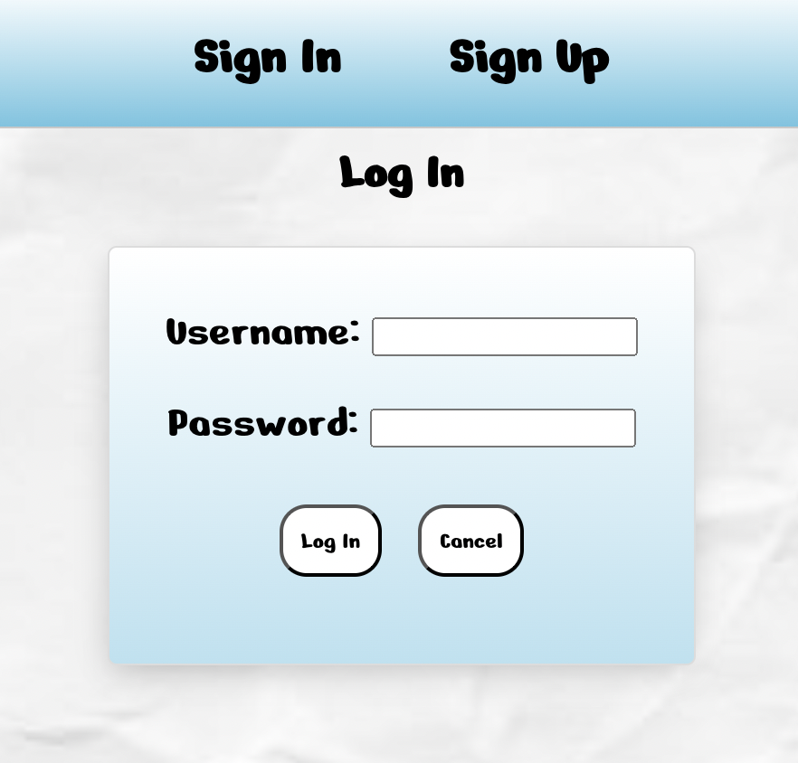
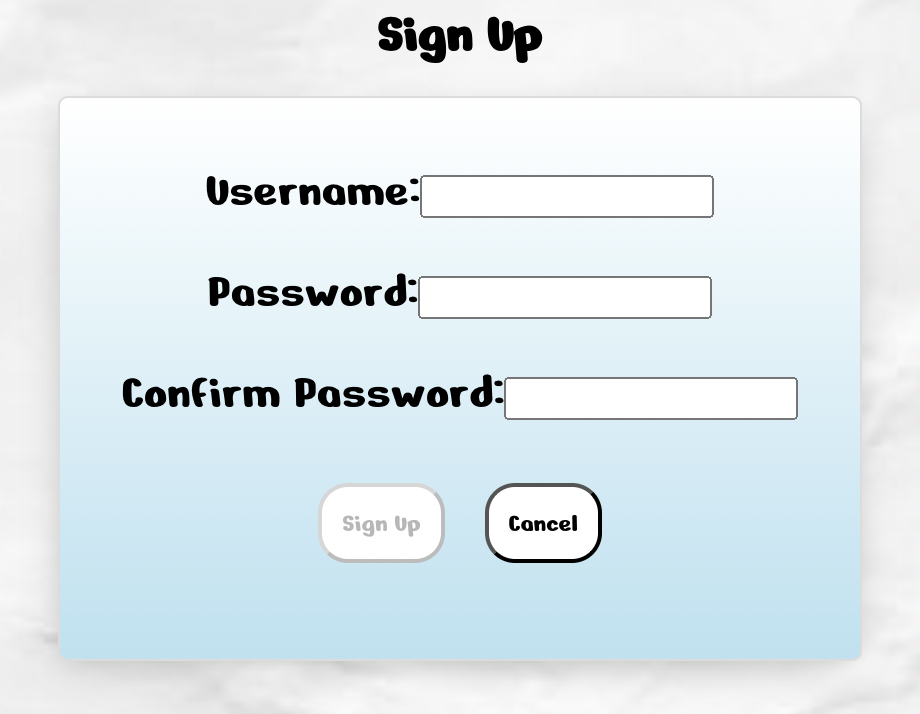
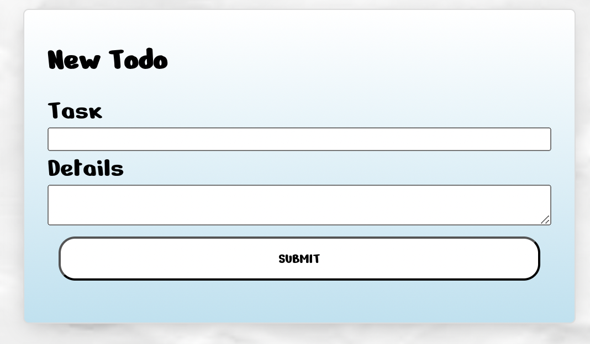
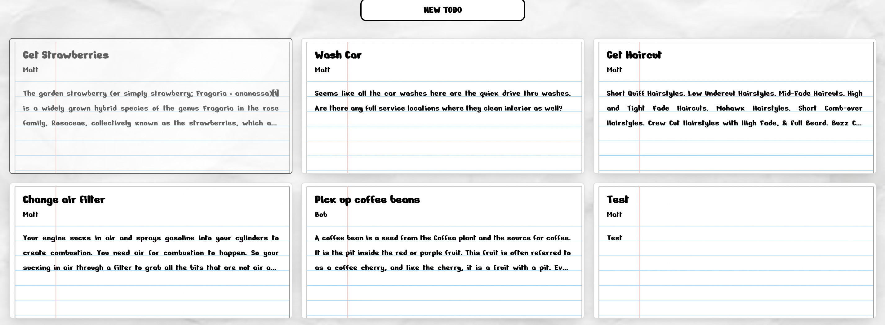
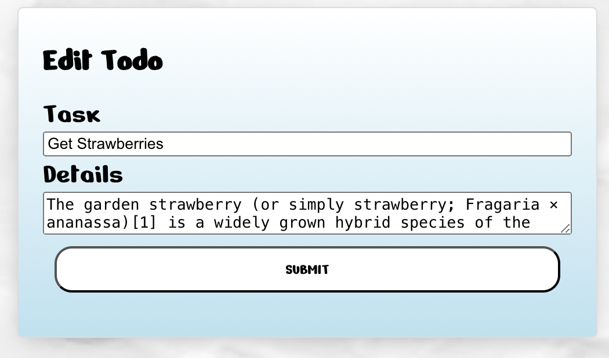
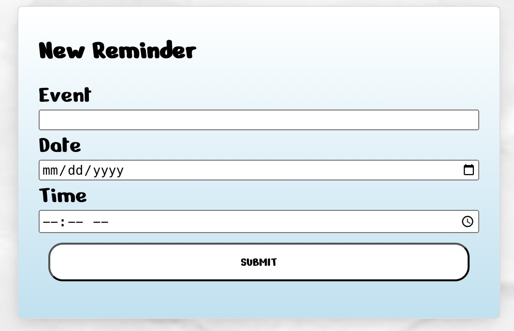
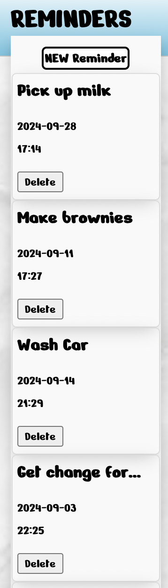

## Technologies Used

## Future Goals

- [ ] Add comments for todos.
- [ ] Add sounds and animations.

## Sign in

## Sign up

## Create Todo

## Todo List

## Edit Todo

Edit

## Create Reminder

## Reminder List

